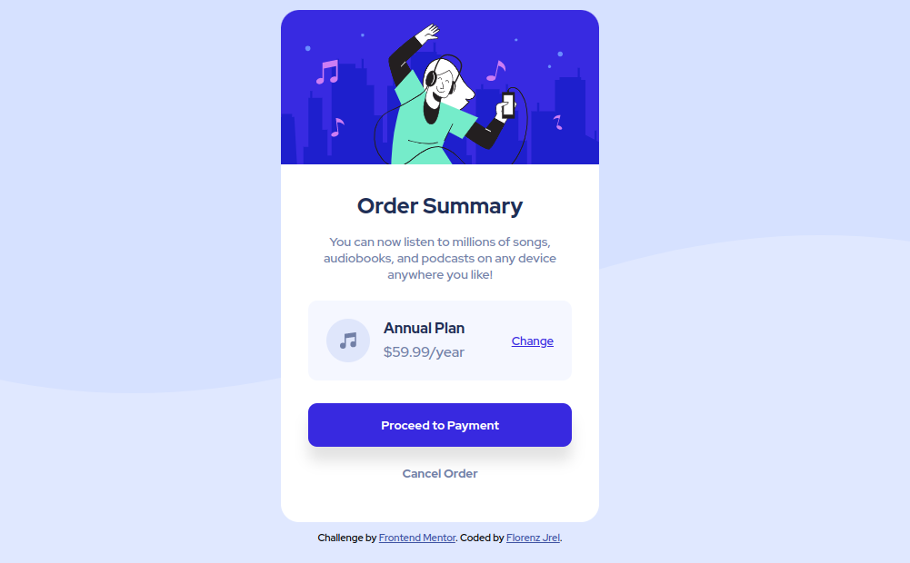

# Frontend Mentor - Order summary card solution

This is a solution to the [Order summary card challenge on Frontend Mentor](https://www.frontendmentor.io/challenges/order-summary-component-QlPmajDUj). Frontend Mentor challenges help you improve your coding skills by building realistic projects. 

## Table of contents

- [Overview](#overview)
  - [The challenge](#the-challenge)
  - [Screenshot](#screenshot)
  - [Links](#links)
- [My process](#my-process)
  - [Built with](#built-with)
- [Author](#author)
- [Acknowledgments](#acknowledgments)

## Overview

### The challenge

Users should be able to:

- See hover states for interactive elements

### Screenshot

### Links

- Solution URL: [https://github.com/florenzjrel/order-summary](https://github.com/florenzjrel/order-summary)
- Live Site URL: [https://florenzjrel.github.io/order-summary/](https://florenzjrel.github.io/order-summary/)

## My process

### Built with

- HTML
- CSS
- Flexbox

## Author

- Frontend Mentor - [@florenzjrel](https://www.frontendmentor.io/profile/florenzjrel)

## Acknowledgments

Grateful for Deniel Den and Adriano Escarabote who helped me out on this project. They gave advices which made my Order Summary much better. 
